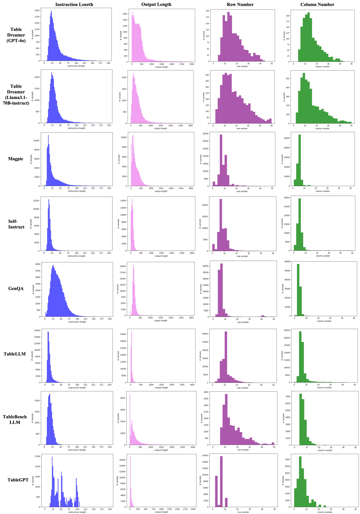
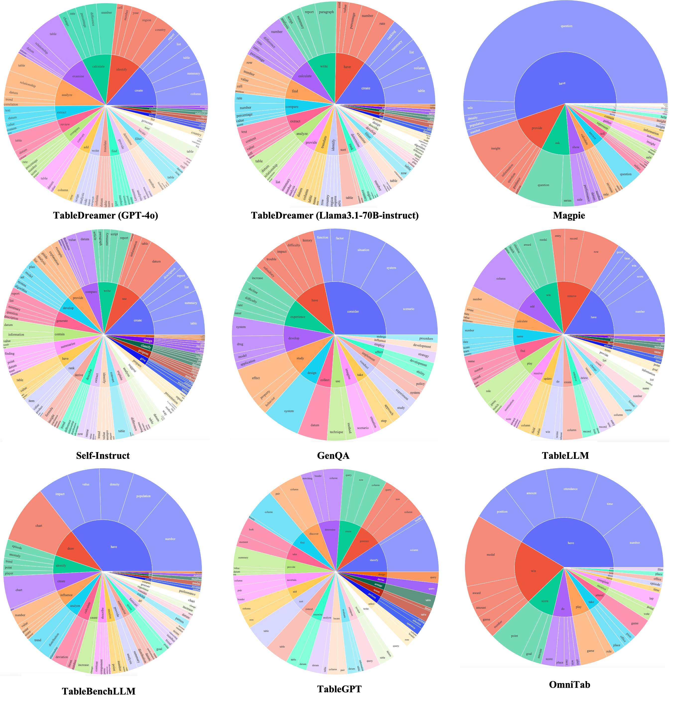
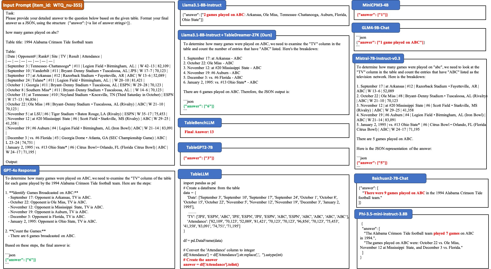

# TableDreamer Synthetic Data

## Synthetic Data
The 27K TableDreamer synthetic instruction tuning data with GPT-4o is stored in the `data` folder, which has been converted into the Alpaca format and can be directly used to fine-tune LLMs with [LLaMA-Factory](https://github.com/hiyouga/LLaMA-Factory) codebase.
Data schema:
```python
{
  "instruction": "Table caption:\nHistorical Patterns of Military Alliances and Their Influence ..." # Synthetic input prompt including synthetic table, table titles and instruction
  "output": "The military strategies used in the 'Thirty Years' War' were primarily focused on ..." # Synthetic output response from GPT-4o or Llama3.1-70B-instruct
}
```

## Data Distribution of Different Synthetic Data


*Figure 1: Comparison of instruction length, output length, table row number and table column number from different synthetic table instruction tuning data.*

## Comparison of Synthetic Instruction Diversity


*Figure 2: The top 25 most prevalent root verbs (the inner circle) and their top 5 direct nouns (the outer circle) in the synthetic instructions of different table instruction tuning data.*

## Case Study of Model Completions


*Figure 3: Example completions from different models.*


