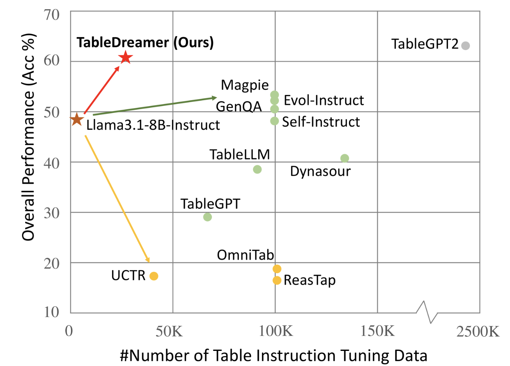

# TableDreamer: A Data Synthesis Pipeline for Table Instruction Tuning
[](https://arxiv.org/abs/2506.08646) [](https://huggingface.co/datasets/SpursgoZmy/TableDreamer-27K) [](https://huggingface.co/SpursgoZmy/TableDreamer-Llama3.1-8B-Instruct) [](https://github.com/hiyouga/LLaMA-Factory)


<font size=8><center><b> Table of Contents: </b> </center></font>
1. [**Introduction**](#1-introduction)
2. [**Synthetic Data and Fine-tuned Model**](#2-synthetic-data-and-fine-tuned-model)
3. [**Fine-tuning with LLaMA-Factory**](#3-fine-tuning-with-llama-factory)
4. [**Evaluation Data and Scripts**](#4-evaluation-data-and-scripts)


## 1. Introduction



LLM-based synthetic data has played an important role in recent development of powerful LLMs. Lots of effort has been dedicated to synthesize training data for different NLP tasks like math, coding, information extraction and so on, but data synthesis for table instruction tuning has not been thoroughly investigated. Recent LLM-based data synthesis methods face several limitations in generating table instruction tuning data. (1) they can not thoroughly explore the vast input space of table understanding tasks, which consists of diverse tables and task instructions, leading to limited data diversity. (2) they ignore the underlying weaknesses in table understanding ability of the target LLM and may blindly pursue the increase of data quantity, resulting in suboptimal data efficiency. (3) synthetic training data with poor diversity could improve table understanding ability but at the huge cost of LLMs' general capacity. In this paper, we introduce a data synthesis pipeline for generating table instruction tuning data (i.e., table, instruction and response), aiming to improve data diversity and efficiency, as well as maintain models' general capacities.

## 2. Synthetic Data and Fine-tuned Model
The 27K TableDreamer synthetic instruction tuning data is available at the [huggingface dataset](https://huggingface.co/datasets/SpursgoZmy/TableDreamer-27K). We synthesize table titles, tables and instructions, and then randomly select one prompt template from multiple candidates to organize them into the final input prompt. The data has been converted into the Alpaca data format and can be directly used to fine-tune LLMs with [LLaMA-Factory](https://github.com/hiyouga/LLaMA-Factory) codebase. 

Data schema:
```python
{
  "instruction": "Table caption:\nHistorical Patterns of Military Alliances and Their Influence ..." # Synthetic input prompt including synthetic table, table title and instruction
  "input": "Not used"
  "output": "The military strategies used in the 'Thirty Years' War' were primarily focused on ..." # Synthetic output response from teacher LLMs like GPT-4o or Llama3.1-70B-instruct
}
```

We use 27K GPT-4o synthetic data to fine-tune Llama3.1-8B-Instruct and the saved model checkpoint by LLaMA-Factory is available at [huggingface model](https://huggingface.co/SpursgoZmy/TableDreamer-Llama3.1-8B-Instruct/tree/main), which can be directly used with transformers and vllm inference. We use the recommended hyperparameters from this paper [Rethinking Table Instruction Tuning](https://arxiv.org/abs/2501.14693) during fine-tuning.

## 3. Fine-tuning with LLaMA-Factory
We use [LLaMA-Factory](https://github.com/hiyouga/LLaMA-Factory) codebase to perform fine-tuning with synthetic data. Download and install Llama-Factory codebase:

```shell
git clone --depth 1 https://github.com/hiyouga/LLaMA-Factory.git
cd LLaMA-Factory
pip install -e ".[torch,metrics]" --no-build-isolation
```

Download the synthetic TableDreamer data in the alpaca format (e.g., `TableDreamer_synthetic_data_27K_alpaca_format_by_GPT-4o.json`) from the [Huggingface](https://huggingface.co/datasets/SpursgoZmy/TableDreamer-27K/tree/main) and put it under the `data` dir in the Llama-Factory codebase. The [dataset_info.json](https://github.com/hiyouga/LLaMA-Factory/blob/main/data/dataset_info.json) contains all available datasets for the Llama-Factory. As we are using a custom dataset, we need to add a dataset description in `dataset_info.json` as following, and specify the `dataset: dataset_name` in the training config file to use it.

```json
{
  "TableDreamer_27K": {
    "file_name": "TableDreamer_synthetic_data_27K_alpaca_format_by_GPT-4o.json"
  },
}
```

The [llama3.1-8b-full_sft_TableDreamer.yaml](https://github.com/SpursGoZmy/TableDreamer/tree/main/training_configs/train_full) contains training hyper-parameters and please make sure specify the dataset_name that is added in the `dataset_info.json` such as 'TableDreamer_27K'. Put the yaml file in the `examples/train_full/' dir. The official script for fine-tuning:

```shell
FORCE_TORCHRUN=1 nohup llamafactory-cli train examples/train_full/llama3.1-8b-full_sft_TableDreamer.yaml \
> ./train_logs/sft_llama3.1_8b_with_TableDreamer.log &
```

## 4. Evaluation Data and Scripts
Our evaluation includes 9 benchmarks where we randomly select one table format from four candidates (TSV, CSV, HTML, Markdown-style) to build the final input prompt of test data, and we also use the original TableGPT benchmark for evaluation. The processed test data for inference can be downloaded from the [HuggingFace](https://huggingface.co/datasets/SpursgoZmy/TableDreamer-27K/tree/main/Evaluation). Use the [TableDreamer_evaluation.ipynb](https://github.com/SpursGoZmy/TableDreamer/blob/main/TableDreamer_evaluation.ipynb) notebook for automatic evaluation on 9 benchmark of TQA, TFV and T2T tasks. For the TableGPT evaluation, we use the official test data and evaluation scripts from the original [TableGPT github](https://github.com/microsoft/Table-GPT).


 
## TODOs
- [x] Synthetic data and fine-tuned models
- [x] Scripts for model fine-tuning.
- [ ] Evaluation data and scripts.
- [ ] Scripts of data synthesis pipeline.


